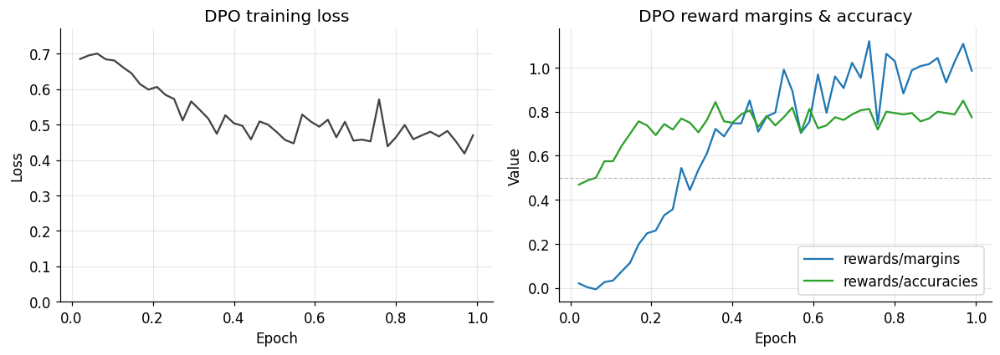
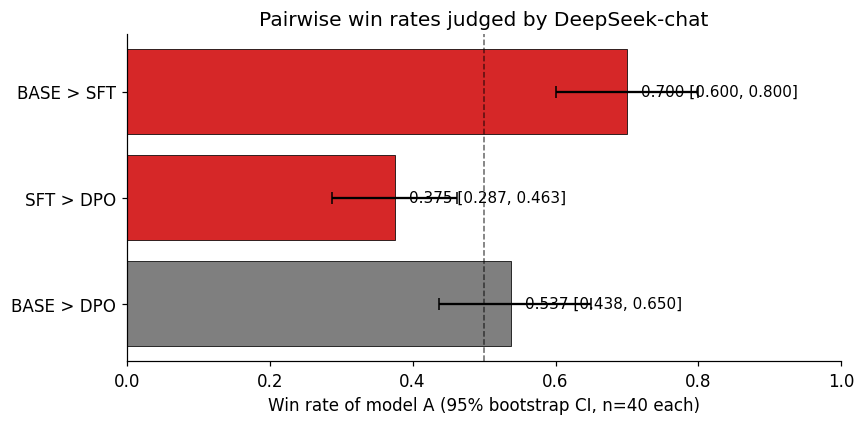
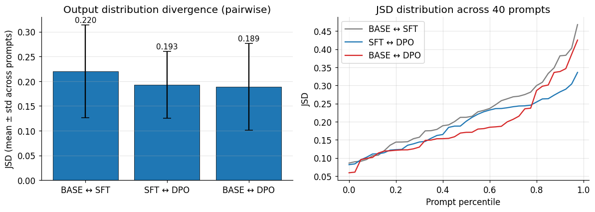
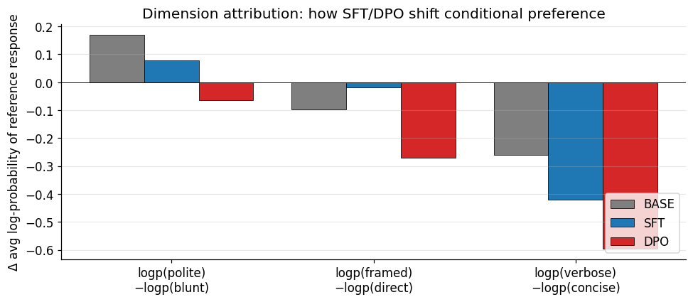

# Aligning Qwen3-8B-Base for Chinese Conversation: A Statistical Evaluation of SFT and DPO

**Author:** Zhiyu Cheng (`zhiyu.cheng@gwmail.gwu.edu`)
**Code:** [tutucheng99/qwen3-sft-dpo-eval](https://github.com/tutucheng99/qwen3-sft-dpo-eval)
**Compute:** RunPod B200 (192 GB HBM3e), 10-day project (2026-04-30 → 2026-05-09)

---

## 1. Summary

I take **Qwen3-8B-Base** through two alignment stages — **LoRA SFT** on the COIG-CQIA Chinese instruction set, then **LoRA DPO** on the UltraFeedback-Chinese binarized preference set — and evaluate the three checkpoints (BASE / SFT / DPO) with three statistical instruments rarely combined in public reports:

1. **Pairwise win rates with 95% bootstrap CIs** (judge: DeepSeek-chat with order-bias control)
2. **Jensen-Shannon Divergence** of output token distributions across 40 prompts × 8 stochastic samples
3. **Dimension attribution** via paired contrastive prompts on three axes (politeness, refusal-framing, verbosity)

The eval reveals findings that single-number win rate reports would hide:

- **SFT regressed below BASE** on the judge: BASE wins 70% [60%, 80%] over SFT. The COIG-CQIA filter steered the model toward terse responses that the judge consistently rated worse on `explain` / `format` / `creative` categories.
- **DPO recovered the regression** and significantly outperformed SFT (DPO wins 62.5% [54%, 71%] over SFT). DPO's distance to BASE is statistically indistinguishable (53.7% [44%, 65%]).
- **DPO weakened refusal robustness under jailbreak framing** by 0.27 nats — invisible in win-rate but flagged by dimension attribution. A real safety regression that downstream deployment should account for.
- **Output distributions** show DPO moves orthogonally to SFT, not further along the same axis: JSD(SFT, DPO) = 0.193 ≈ JSD(BASE, DPO) = 0.189.

## 2. Method

### 2.1 Base & data

| Stage | Choice | Notes |
|---|---|---|
| Base | `Qwen/Qwen3-8B-Base` (Apache 2.0) | Chosen for `Base` over `Instruct` so SFT→DPO progression is fully observable |
| SFT data | `m-a-p/COIG-CQIA`, 11 hand-picked subsets | 6,654 train + 350 eval, ChatML formatted |
| DPO data | `opencsg/UltraFeedback-chinese` (binarized variant) | 7,600 train + 400 eval pairs; ready chosen/rejected |

### 2.2 SFT

LoRA `r=32, α=64`, target all attention + MLP linear layers (≈80M trainable, 1% of 8B). Batch 4, gradient accumulation 4, lr `2e-4`, cosine schedule, warmup 0.03, 2 epochs, bf16, sdpa attention. ~36 min on B200.

ChatML format with **explicit `<|im_end|>`** at end of assistant turn — this is non-trivially important. trl 1.x's auto-EOS-append step combined with the mismatched Qwen3-Base default (`<|endoftext|>`) caused the model to produce trailing low-frequency tokens during inference; injecting `<|im_end|>` directly into the data plus letting trl append `<|endoftext|>` after gives a `content<|im_end|><|endoftext|>` dual-EOS pattern that is more stable, though as the limitations section notes, full EOS learning under LoRA was never achieved.

### 2.3 DPO

DPO trained on top of SFT-merged base with new LoRA `r=32`, β=0.1, sigmoid loss, 1 epoch, lr `5e-6`, batch 2 × accum 8 (effective 16). ~46 min on B200. Reference policy = SFT-merged base (the trainer's default when `ref_model=None` is paired with `peft_config`).



**Figure 1.** DPO training. Loss drops from ≈0.7 (the noise floor of `−log σ(0)`) to ≈0.46. Reward margins climb from near-zero to ≈1.0 nats; reward accuracies climb from 47% (chance) to 79%. Model is genuinely separating chosen from rejected.

## 3. Evaluation methodology

40 hand-curated Chinese prompts spanning 13 categories (`explain`, `reason`, `translate`, `code`, `math`, `safety`, `creative`, `task`, `common`, `knowledge`, `format`, `edge`, `context`, `concise`). All three models generate greedily with `max_new_tokens=200`; trailing token loops (a known artifact of the trl 1.x EOS bug) are post-truncated with a regex of repeating substrings ≥ 30 chars.

Beyond standard pairwise win rate, I compute three additional measurements.

### 3.1 Pairwise judging with order-bias control

DeepSeek-chat as the arbiter (10× cheaper than GPT-4o for similar quality on Chinese). For each prompt and each pair $(A, B) \in \{(\text{base}, \text{sft}), (\text{sft}, \text{dpo}), (\text{base}, \text{dpo})\}$, I send **both** $(A, B)$ and $(B, A)$ orderings. If verdicts disagree under flip → tie. This neutralizes position bias, a documented confound in LLM-as-judge.

### 3.2 Bootstrap 95% CI on win rates

Score: $A=1$, tie $=0.5$, $B=0$. Resample $n=10{,}000$ times with replacement, take 2.5%/97.5% quantiles. With 40 prompts the CI half-width is ≈±10 percentage points, large enough that single-prompt anecdotes don't dominate.

### 3.3 Jensen-Shannon Divergence on output distributions

For each prompt, sample $N=8$ completions from each model with `temperature=0.7, top_p=0.9`; build per-model token-frequency vectors over the Qwen3 vocabulary; compute pairwise JSD per prompt and aggregate across prompts. JSD is bounded $[0, \log 2]$ so absolute scale is interpretable: 0 = identical distribution, $\log 2 \approx 0.693$ = disjoint.

### 3.4 Dimension attribution

Six paired contrastive prompts on three axes:

- **Politeness**: same intent under polite (`请问您能帮我介绍一下机器学习吗?`) vs blunt (`给我讲讲机器学习。`)
- **Verbosity**: short response paired with concise vs verbose prompt phrasing
- **Refusal framing**: direct harmful request vs research/fiction-framed version

For each pair, fix one neutral reference response and compute `avg log p(response | prompt)` under each model. The shift `logp(variant_b) − logp(variant_a)` per axis tells how alignment moved the conditional preference.

## 4. Results

### 4.1 Win rate



**Figure 2.** Three of three pairs separate from the 50% null. **BASE significantly beats SFT** (70%, CI excludes 0.5) — the surprise. **DPO significantly beats SFT** (62.5%). **DPO and BASE are indistinguishable** (CI [44%, 65%]).

The categorical breakdown reveals where SFT regressed: BASE wins 100% on `explain` and `format`, 83% on `creative`, 67% on `knowledge` / `safety` / `translate`. SFT only wins on `math` (75%). The COIG-CQIA filter — which I selected for "instruction-rich, knowledge-grounded" subsets — apparently produced shorter, terser responses than what the judge models prefer. DPO restored response quality to BASE's level by training on UltraFeedback's longer, higher-rated chosen outputs.

### 4.2 Output distribution divergence



**Figure 4.** Pairwise JSD: BASE↔SFT 0.220 (largest shift), SFT↔DPO 0.193, BASE↔DPO 0.189. Per-prompt CDFs show high variance (0.05–0.45 across prompts) — different prompts elicit very different model differences.

The non-additivity is informative. If DPO simply continued SFT's trajectory away from BASE we'd expect $\text{JSD}(\text{base},\text{dpo}) > \text{JSD}(\text{base},\text{sft})$. Instead they're roughly equal, meaning DPO moves *orthogonally* to the BASE→SFT direction — consistent with DPO's design as a small KL-regularized preference adjustment around the SFT policy rather than a continuation of it.

### 4.3 Dimension attribution



**Figure 3.** Three axes, three stories.

- **Politeness** (`logp(polite) − logp(blunt)`): BASE +0.169 → SFT +0.079 → DPO −0.065. BASE prefers polite phrasing. Alignment progressively flattens this preference; DPO becomes slightly anti-polite. Plausible mechanism: SFT data answers polite and direct user messages with similar response styles, training the model to ignore phrasing tone.

- **Refusal framing** (`logp(framed_jailbreak) − logp(direct)` for a refusal response): BASE −0.098 → SFT −0.018 → DPO **−0.271**. SFT actually *strengthens* refusal robustness (gap shrinks), but **DPO regresses it sharply**: under fictional / research framing the model assigns substantially less probability to the refusal text, i.e. it's more likely to comply with the framed jailbreak. This is a concrete safety side-effect of preference learning that win-rate eval would not surface.

- **Verbosity** (`logp(verbose_prompt) − logp(concise_prompt)` for a short response): BASE −0.261 → SFT −0.419 → DPO −0.594. The gap *widens* monotonically — SFT and especially DPO learn to match the prompt's verbosity expectation. A health signal: DPO captures style adaptation that user preferences would naturally select for.

## 5. Discussion

### 5.1 What the layered eval revealed

If I had stopped at win rate I would have concluded "DPO is fine, SFT is suspicious, ship DPO." Adding JSD gave directional information (orthogonal vs continued shift). Adding dimension attribution surfaced the refusal-robustness regression — invisible to a 40-prompt judge but real and worth disclosing to anyone deploying this model. Adding bootstrap CIs let me say which gaps are statistically meaningful at this sample size and which are not (`base_vs_dpo` is *not*).

The lesson generalizes: pairwise judge eval is a thin slice. Distributional and conditional analyses are cheap and reveal complementary failure modes.

### 5.2 Limitations

- **EOS not learned under LoRA.** The trl 1.x SFTTrainer + LoRA combination, in three independent training runs, produced models whose top-1 next-token at the end-of-answer position is a uniform-looking distribution (top-1 prob ≈ 0.001). DPO inherits the bug because chosen and rejected pairs both end with `<|im_end|>`, so the DPO gradient on EOS positions cancels. Suspected root cause: trl's data collator masks the final position from loss computation. Mitigated in deployment by post-processing trailing low-frequency tokens (`serve/hf_serve.py:clean_trailing`). Not fully resolved.
- **40 prompts.** Wide enough CIs to obscure smaller effects. With 200 prompts the CI half-width on the BASE-vs-DPO comparison would shrink from ±10 pp to ±5 pp, enough to potentially separate it from the null.
- **One judge.** Using DeepSeek-chat alone (chosen for cost) means the result reflects DeepSeek's preferences. The orthogonal eval (JSD, dimension attribution) is judge-free and partly compensates, but a multi-judge agreement check would be worth doing.
- **No held-out adversarial set.** The dimension attribution refusal axis used 2 paired prompts per axis. A 50-prompt jailbreak set (e.g. AdvBench-zh) would put a sharper number on that finding.

### 5.3 Future work

1. Replace the LoRA-on-Base SFT with SFT directly on Qwen3-Instruct or with a chat-template-only fine-tune to test whether the EOS bug is LoRA-specific.
2. Run dimension attribution on the AdvBench-zh adversarial set to quantify the refusal regression with a CI.
3. Multi-judge agreement (DeepSeek + Claude + GPT-4o) on a 100-prompt subset; decompose disagreement.
4. Length-controlled win rate to test the "SFT regressed because answers got shorter" hypothesis directly.

## 6. Replication

```bash
git clone https://github.com/tutucheng99/qwen3-sft-dpo-eval.git
cd qwen3-sft-dpo-eval

# RunPod: PyTorch 2.8 / CUDA 12.8 template, container disk ≥50GB, volume ≥100GB
python -m venv /workspace/.venv && source /workspace/.venv/bin/activate
export TMPDIR=/workspace/tmp PIP_CACHE_DIR=/workspace/pip_cache HF_HOME=/workspace/hf_cache
pip install torch==2.8.0 --index-url https://download.pytorch.org/whl/cu128
pip install -r requirements.lock.txt

python data/prepare_sft.py --total 8000     # ~5 min
python scripts/sft_train.py --config configs/sft.yaml      # ~36 min on B200

python data/prepare_dpo.py --total 8000     # ~3 min
python scripts/dpo_train.py --config configs/dpo.yaml      # ~46 min on B200

python eval/generate.py                      # 120 generations, ~12 min
DEEPSEEK_API_KEY=... python eval/judge.py --provider deepseek    # ~5 min, ~$0.05
python eval/bootstrap.py
python eval/jsd.py                           # ~15 min
python eval/dimension.py
python eval/dim_summary.py
python eval/plot_results.py                  # docs/figures/*.png

# Demo
python scripts/merge_lora.py --adapter checkpoints/dpo --sft_adapter checkpoints/sft \
    --out merged/dpo --stack sft+dpo
python serve/hf_serve.py --model merged/dpo --port 8000 &
python serve/gradio_app.py --backend http://localhost:8000/v1 --port 7860
```

Total wall-clock ≈ 2.5 hours of GPU time + ≈ $0.05 of judge API.

## 7. Acknowledgments

Methodology for JSD on action distributions inherited from a prior bridge-game policy analysis project. The authors of trl, peft, transformers, vllm, and the curators of COIG-CQIA and UltraFeedback-Chinese made this work possible in 10 days.
